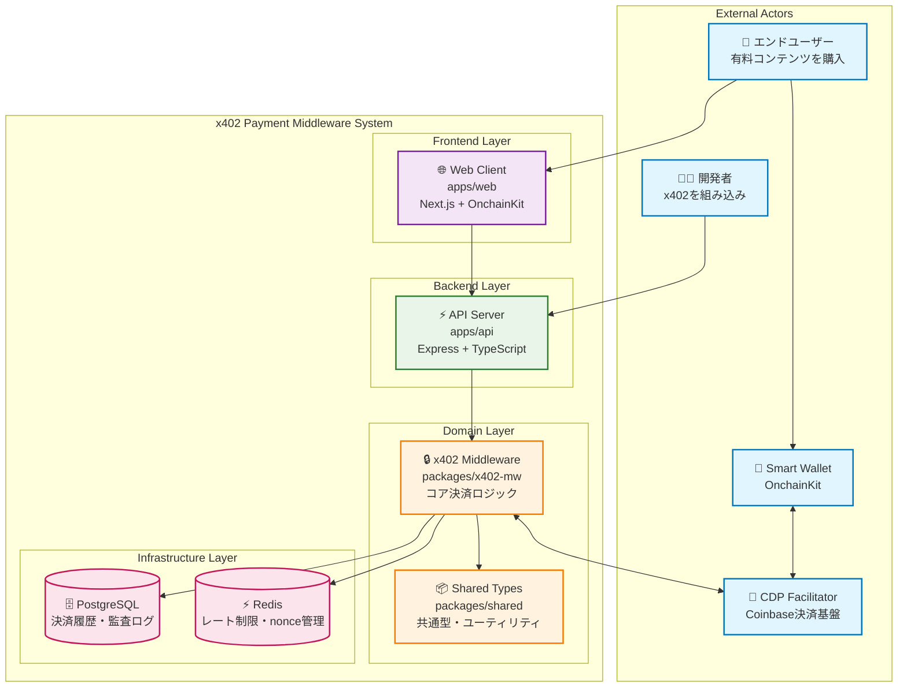
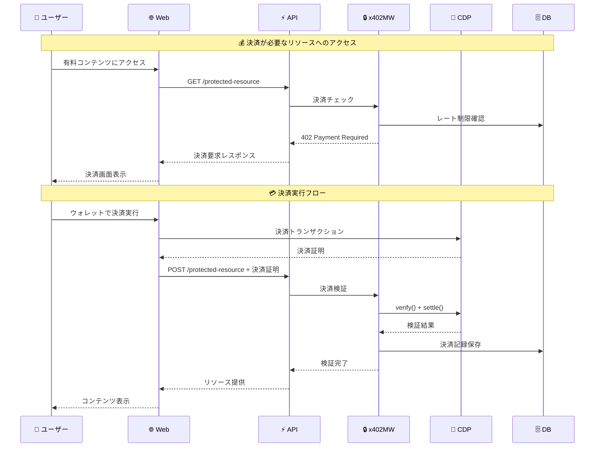
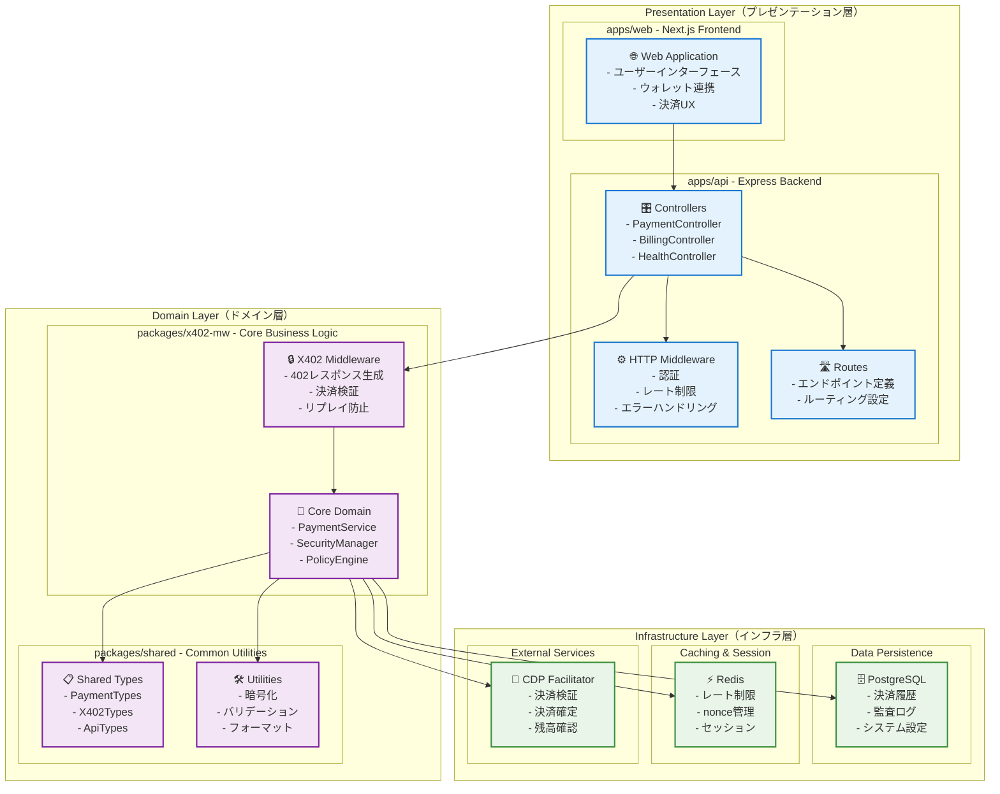
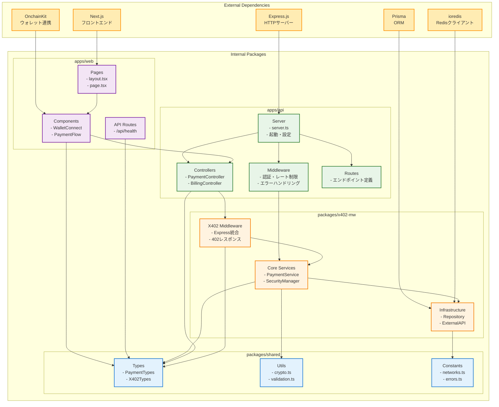
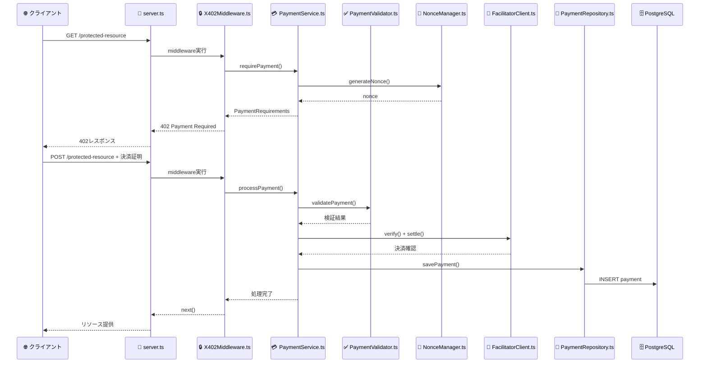

# x402決済ミドルウェア アーキテクチャ設計

## 設計方針：モジュラー・レイヤードアーキテクチャ

### 1. 基本原則

#### 1.1 MVPに最適化された軽量アーキテクチャ
- **DDD軽量版**：Value Object と Service は採用、Aggregate/Repository は簡素化
- **明確な責務分離**：各レイヤーの役割を明確に定義
- **テスタビリティ**：依存性注入とモック化が容易
- **拡張性**：将来のDDD完全移行を見据えた設計

#### 1.2 モノレポ構成での責務分離
```
/packages
  /x402-mw     # コアミドルウェア（ドメインロジック）
  /shared      # 共通型・ユーティリティ
/apps
  /api         # HTTPサーバー（インターフェース層）
  /web         # クライアント
```

## 2. レイヤー構成

### 2.1 アプリケーション層 (`apps/api`)
```typescript
// apps/api/src/
├── controllers/          # HTTPエンドポイント
│   ├── PaymentController.ts
│   ├── BillingController.ts
│   └── HealthController.ts
├── middleware/           # HTTP関連ミドルウェア
│   ├── authMiddleware.ts
│   ├── rateLimitMiddleware.ts
│   └── errorHandler.ts
├── routes/              # ルーティング定義
└── server.ts            # サーバー起動
```

### 2.2 ドメイン層 (`packages/x402-mw`)
```typescript
// packages/x402-mw/src/
├── core/                # コアドメインロジック
│   ├── payment/
│   │   ├── PaymentService.ts        # 支払い処理サービス
│   │   ├── PaymentValidator.ts      # 支払い検証ロジック
│   │   └── PaymentPolicyEngine.ts   # 価格・ポリシー管理
│   ├── security/
│   │   ├── NonceManager.ts          # nonce管理
│   │   ├── RateLimiter.ts          # レート制限
│   │   └── ReplayGuard.ts          # リプレイ防止
│   └── facilitator/
│       ├── FacilitatorClient.ts     # Facilitator抽象化
│       └── CDPFacilitatorClient.ts  # CDP具象実装
├── infrastructure/      # インフラ層
│   ├── database/
│   │   ├── PaymentRepository.ts
│   │   ├── NonceRepository.ts
│   │   └── AuditLogRepository.ts
│   ├── cache/
│   │   └── RedisClient.ts
│   └── external/
│       └── facilitator/
├── middleware/          # Express/Fastifyミドルウェア
│   └── X402Middleware.ts
└── types/              # ドメイン型定義
```

### 2.3 共通層 (`packages/shared`)
```typescript
// packages/shared/src/
├── types/              # 共通型定義
│   ├── PaymentTypes.ts
│   ├── X402Types.ts
│   └── ApiTypes.ts
├── utils/              # ユーティリティ
│   ├── crypto.ts
│   ├── validation.ts
│   └── formatting.ts
└── constants/          # 定数
    ├── networks.ts
    └── errors.ts
```

## 3. 具体的な設計パターン

### 3.1 Service Pattern（DDD軽量版）
```typescript
// PaymentService.ts - ドメインロジックの中核
export class PaymentService {
  constructor(
    private facilitatorClient: FacilitatorClient,
    private nonceManager: NonceManager,
    private paymentRepository: PaymentRepository,
    private auditLogger: AuditLogger
  ) {}

  async processPayment(request: PaymentRequest): Promise<PaymentResult> {
    // 1. nonce検証
    await this.nonceManager.validateNonce(request.nonce);
    
    // 2. Facilitator連携
    const verification = await this.facilitatorClient.verify(request);
    const settlement = await this.facilitatorClient.settle(verification);
    
    // 3. 監査ログ記録
    await this.auditLogger.logPayment(settlement);
    
    return settlement;
  }
}
```

### 3.2 Repository Pattern（簡素版）
```typescript
// PaymentRepository.ts - データアクセス抽象化
export interface PaymentRepository {
  save(payment: Payment): Promise<void>;
  findByTxHash(txHash: string): Promise<Payment | null>;
  findByPayer(address: string, from: Date, to: Date): Promise<Payment[]>;
}

export class PostgresPaymentRepository implements PaymentRepository {
  // 具象実装
}
```

### 3.3 Value Object Pattern
```typescript
// PaymentAmount.ts - 金額の値オブジェクト
export class PaymentAmount {
  constructor(
    private readonly amount: bigint,
    private readonly currency: string
  ) {
    if (amount <= 0n) throw new Error('Amount must be positive');
  }

  toAtomicUnits(): bigint { return this.amount; }
  toCurrency(): string { return this.currency; }
  equals(other: PaymentAmount): boolean {
    return this.amount === other.amount && this.currency === other.currency;
  }
}
```

### 3.4 Factory Pattern
```typescript
// PaymentRequirementsFactory.ts - 402応答生成
export class PaymentRequirementsFactory {
  static create(
    resource: string,
    amount: PaymentAmount,
    network: Network
  ): PaymentRequirements {
    return {
      scheme: 'https://rfc.x402.org/schemes/eip3009',
      network: network.name,
      maxAmountRequired: amount.toAtomicUnits().toString(),
      asset: amount.toCurrency(),
      payTo: network.receiverAddress,
      resource,
      nonce: generateNonce(),
      validUntil: new Date(Date.now() + 5 * 60 * 1000) // 5分
    };
  }
}
```

## 4. 依存性注入（軽量版）

### 4.1 DIコンテナ設定
```typescript
// container.ts - 依存性の組み立て
export class Container {
  private static instance: Container;
  private services = new Map<string, any>();

  static getInstance(): Container {
    if (!Container.instance) {
      Container.instance = new Container();
    }
    return Container.instance;
  }

  register<T>(key: string, factory: () => T): void {
    this.services.set(key, factory);
  }

  resolve<T>(key: string): T {
    const factory = this.services.get(key);
    if (!factory) throw new Error(`Service ${key} not found`);
    return factory();
  }
}

// 設定例
container.register('paymentService', () => new PaymentService(
  container.resolve('facilitatorClient'),
  container.resolve('nonceManager'),
  container.resolve('paymentRepository'),
  container.resolve('auditLogger')
));
```

## 5. テスト戦略

### 5.1 レイヤー別テスト
```typescript
// 単体テスト例
describe('PaymentService', () => {
  let service: PaymentService;
  let mockFacilitator: jest.Mocked<FacilitatorClient>;
  let mockNonceManager: jest.Mocked<NonceManager>;

  beforeEach(() => {
    mockFacilitator = createMockFacilitator();
    mockNonceManager = createMockNonceManager();
    service = new PaymentService(mockFacilitator, mockNonceManager, ...);
  });

  it('should process valid payment', async () => {
    // テストロジック
  });
});
```

## 6. エラーハンドリング戦略

### 6.1 ドメインエラーの階層化
```typescript
// errors.ts
export abstract class DomainError extends Error {
  abstract readonly code: string;
  abstract readonly statusCode: number;
}

export class PaymentValidationError extends DomainError {
  readonly code = 'PAYMENT_VALIDATION_ERROR';
  readonly statusCode = 400;
}

export class InsufficientFundsError extends DomainError {
  readonly code = 'INSUFFICIENT_FUNDS';
  readonly statusCode = 402;
}
```

## 7. 設定管理

### 7.1 環境別設定
```typescript
// config.ts
export interface Config {
  database: DatabaseConfig;
  redis: RedisConfig;
  facilitator: FacilitatorConfig;
  payment: PaymentConfig;
}

export const config: Config = {
  database: {
    url: process.env.DATABASE_URL!,
    ssl: process.env.NODE_ENV === 'production'
  },
  facilitator: {
    mode: process.env.MODE as 'facilitator' | 'self',
    cdpApiKey: process.env.CDP_API_KEY!,
    baseUrl: process.env.CDP_BASE_URL!
  },
  payment: {
    network: process.env.X402_NETWORK!,
    asset: process.env.X402_ASSET!,
    receiverAddress: process.env.RECEIVER_ADDRESS!
  }
};
```

## 8. 監視・ログ設計

### 8.1 構造化ログ
```typescript
// logger.ts
export interface LogContext {
  traceId: string;
  userId?: string;
  paymentId?: string;
}

export class Logger {
  static payment(context: LogContext, event: string, data: any) {
    console.log(JSON.stringify({
      timestamp: new Date().toISOString(),
      level: 'info',
      category: 'payment',
      event,
      context,
      data
    }));
  }
}
```

## 9. 将来への移行パス

### 9.1 DDD完全版への移行準備
この軽量アーキテクチャは、将来的に以下への移行が容易：

1. **Aggregate Root**: PaymentService → PaymentAggregate
2. **Domain Events**: 支払い完了イベントの導入
3. **CQRS**: 読み取り専用モデルの分離
4. **Event Sourcing**: 支払い履歴の完全追跡

### 9.2 マイクロサービス化
必要に応じて以下の分離が可能：
- 支払い検証サービス
- レート制限サービス  
- 監査ログサービス
- 会計エクスポートサービス

## 10. 開発ガイドライン

### 10.1 コーディング規約
- **関数は小さく**: 1つの責務に集中
- **依存性は注入**: テスタビリティを重視
- **型安全性**: TypeScriptの型システムを最大活用
- **エラーハンドリング**: すべての例外ケースを考慮

### 10.2 コミット戦略
- **機能単位**: 各レイヤーを独立してテスト可能
- **段階的リリース**: 基本機能→拡張機能の順序
- **後方互換性**: API変更時の互換性維持

---

このアーキテクチャは**MVPの速度**と**将来の拡張性**のバランスを取った設計となっています。フルDDDの複雑さを避けながら、良い設計原則は維持しています。

---

# 📊 新規参画者向けアーキテクチャ図

## 1. システム全体俯瞰図（Context Diagram）

### 1.1 システム全体の関係性


### 1.2 主要な責務と役割

| コンポーネント | 主な責務 | 新規参画者が知るべきポイント |
|---------------|---------|---------------------------|
| **Web Client** | ユーザーインターフェース、ウォレット連携 | Next.js + OnchainKit、決済UXの入口 |
| **API Server** | HTTPエンドポイント、ルーティング | Express、外部からのアクセス窓口 |
| **x402 Middleware** | 決済検証、セキュリティ、ビジネスロジック | **最も重要**、コアドメインロジック |
| **Shared Types** | 型定義、ユーティリティ | 全体で共有する定義、一貫性の要 |
| **PostgreSQL** | 永続化、監査ログ | 決済履歴、コンプライアンス対応 |
| **Redis** | キャッシュ、セッション管理 | 高速アクセス、レート制限 |

### 1.3 データフローの概要


## 2. レイヤー別責務分離図

### 2.1 アーキテクチャレイヤーの全体像


### 2.2 各レイヤーの責務詳細

#### **Presentation Layer（プレゼンテーション層）**
- **役割**: 外部との接点、UIとAPI
- **技術**: Next.js, Express.js
- **新規参画者への注意**: ここはビジネスロジックを書かない

#### **Domain Layer（ドメイン層）**  
- **役割**: ビジネスルール、コアロジック
- **技術**: TypeScript, DDD軽量版
- **新規参画者への注意**: **最重要レイヤー**、ここに集中して理解する

#### **Infrastructure Layer（インフラ層）**
- **役割**: データ永続化、外部サービス連携
- **技術**: PostgreSQL, Redis, CDP API
- **新規参画者への注意**: ドメイン層から利用される

## 3. モジュール間依存関係図

### 3.1 パッケージ間の依存関係


### 3.2 依存関係のルール

#### **✅ 許可される依存関係**
```
apps/web → packages/shared (型・ユーティリティの利用)
apps/api → packages/x402-mw (ミドルウェアの利用)
apps/api → packages/shared (型・ユーティリティの利用)
packages/x402-mw → packages/shared (共通機能の利用)
```

#### **❌ 禁止される依存関係**
```
packages/shared → apps/* (逆依存は禁止)
packages/x402-mw → apps/* (逆依存は禁止)
apps/web → apps/api (直接的な依存は禁止)
```

### 3.3 重要な設計原則
- **単方向依存**: 上位レイヤーから下位レイヤーへの依存のみ
- **共通パッケージ**: `packages/shared`は他のパッケージに依存しない
- **ドメイン分離**: `packages/x402-mw`はビジネスロジックに集中

## 4. 詳細なファイル間関連図

### 4.1 実際のファイル構造と依存関係

```mermaid
graph TB
    subgraph "apps/web/src"
        Layout[app/layout.tsx<br/>🎨 レイアウト定義]
        Page[app/page.tsx<br/>🏠 メインページ]
        HealthAPI[app/api/health/route.ts<br/>💚 ヘルスチェック]
    end
    
    subgraph "apps/api/src"
        Server[server.ts<br/>🚀 サーバー起動]
        DBHelpers[database/helpers.ts<br/>🗄️ DB操作ヘルパー]
    end
    
    subgraph "packages/x402-mw/src (予定)"
        PaymentService[core/payment/PaymentService.ts<br/>💳 決済処理サービス]
        PaymentValidator[core/payment/PaymentValidator.ts<br/>✅ 決済検証ロジック]
        NonceManager[core/security/NonceManager.ts<br/>🔐 nonce管理]
        RateLimiter[core/security/RateLimiter.ts<br/>⏱️ レート制限]
        X402Middleware[middleware/X402Middleware.ts<br/>🔒 Express連携]
        PaymentRepo[infrastructure/database/PaymentRepository.ts<br/>💾 決済データ永続化]
        FacilitatorClient[core/facilitator/FacilitatorClient.ts<br/>🏦 CDP連携抽象化]
    end
    
    subgraph "packages/shared/src"
        PaymentTypes[types/PaymentTypes.ts<br/>📋 決済関連型定義]
        X402Types[types/X402Types.ts<br/>📋 X402プロトコル型]
        ApiTypes[types/ApiTypes.ts<br/>📋 API型定義]
        CryptoUtils[utils/crypto.ts<br/>🔐 暗号化ユーティリティ]
        Networks[constants/networks.ts<br/>🌐 ネットワーク定数]
    end
    
    subgraph "External Files"
        PrismaSchema[apps/api/prisma/schema.prisma<br/>🗄️ データベーススキーマ]
        DockerCompose[docker-compose.yml<br/>🐳 開発環境設定]
        PackageJSON[package.json<br/>📦 依存関係管理]
    end
    
    %% File dependencies
    Layout --> PaymentTypes
    Page --> PaymentTypes
    Page --> X402Types
    HealthAPI --> ApiTypes
    
    Server --> DBHelpers
    Server --> X402Middleware
    DBHelpers --> PrismaSchema
    
    X402Middleware --> PaymentService
    PaymentService --> PaymentValidator
    PaymentService --> NonceManager
    PaymentService --> FacilitatorClient
    PaymentService --> PaymentRepo
    PaymentValidator --> PaymentTypes
    NonceManager --> CryptoUtils
    RateLimiter --> Networks
    PaymentRepo --> PrismaSchema
    
    PaymentService --> PaymentTypes
    PaymentService --> X402Types
    FacilitatorClient --> ApiTypes
    
    %% Styling
    classDef web fill:#f3e5f5,stroke:#7b1fa2,stroke-width:2px
    classDef api fill:#e8f5e8,stroke:#2e7d32,stroke-width:2px
    classDef middleware fill:#fff3e0,stroke:#f57c00,stroke-width:2px
    classDef shared fill:#e3f2fd,stroke:#1976d2,stroke-width:2px
    classDef external fill:#ffecb3,stroke:#ff8f00,stroke-width:2px
    
    class Layout,Page,HealthAPI web
    class Server,DBHelpers api
    class PaymentService,PaymentValidator,NonceManager,RateLimiter,X402Middleware,PaymentRepo,FacilitatorClient middleware
    class PaymentTypes,X402Types,ApiTypes,CryptoUtils,Networks shared
    class PrismaSchema,DockerCompose,PackageJSON external
```


### 4.2 ファイルの役割と責務

#### **🎯 新規参画者が最初に理解すべきファイル（優先度順）**

1. **`packages/shared/src/types/PaymentTypes.ts`** 
   - 決済関連の全ての型定義
   - システム全体で使用される基本概念

2. **`packages/shared/src/types/X402Types.ts`**
   - X402プロトコル仕様の型定義
   - 402レスポンスの構造

3. **`packages/x402-mw/src/core/payment/PaymentService.ts`**
   - **最重要**: 決済処理のメインロジック
   - 全ての決済フローが通る中心点

4. **`packages/x402-mw/src/middleware/X402Middleware.ts`**
   - Expressとの連携ポイント
   - HTTPリクエスト/レスポンスの処理

5. **`apps/api/src/server.ts`**
   - アプリケーションのエントリーポイント
   - 全体の初期化処理

### 4.3 データフロー：実際のファイル間の処理の流れ


## 5. 新規参画者向け学習パス

### 5.1 推奨学習順序

#### **Phase 1: 全体理解（1-2日）**
1. この`ARCHITECTURE.md`を読む
2. `docs/day1_completed.md`で現在の実装状況を確認
3. `docker-compose.yml`で開発環境を理解

#### **Phase 2: 型システム理解（1日）**
1. `packages/shared/src/types/PaymentTypes.ts`
2. `packages/shared/src/types/X402Types.ts`
3. `packages/shared/src/types/ApiTypes.ts`

#### **Phase 3: コアロジック理解（2-3日）**
1. `packages/x402-mw/src/core/payment/PaymentService.ts`（最重要）
2. `packages/x402-mw/src/middleware/X402Middleware.ts`
3. `packages/x402-mw/src/core/security/NonceManager.ts`

#### **Phase 4: 実装詳細（1-2日）**
1. `apps/api/src/server.ts`
2. `apps/api/src/database/helpers.ts`
3. `apps/web/src/app/page.tsx`

### 5.2 デバッグ・トラブルシューティング時の調査順序

1. **ログ確認**: `apps/api/src/server.ts`のログ出力
2. **型エラー**: `packages/shared/src/types/`の型定義
3. **決済エラー**: `packages/x402-mw/src/core/payment/`
4. **DB接続**: `apps/api/src/database/helpers.ts`
5. **外部API**: `packages/x402-mw/src/core/facilitator/`

## 6. 新規参画者向けクイックスタートガイド

### 6.1 開発環境セットアップ（初日）

#### **Step 1: 環境準備**
```bash
# リポジトリクローン
git clone <repository-url> x402_me
cd x402_me

# 依存関係インストール（pnpmを使用）
pnpm install

# 環境変数設定
cp env.example .env
# .envファイルを適切に設定

# Docker環境起動
docker-compose up -d
```

#### **Step 2: 動作確認**
```bash
# ヘルスチェック確認
curl http://localhost:3000/api/health  # Web
curl http://localhost:3001/health      # API

# データベース確認
docker exec -it x402_me-postgres-1 psql -U postgres -d x402_db
```

#### **Step 3: 開発サーバー起動**
```bash
# 開発モードで起動
pnpm dev

# または個別起動
pnpm --filter @x402/web dev    # フロントエンド
pnpm --filter @x402/api dev    # バックエンド
```

### 6.2 コードリーディング・ガイド

#### **🚀 最初の1時間で読むべきファイル**
```
1. README.md または docs/READ.ME          (5分)
2. docs/day1_completed.md                 (10分)
3. この docs/ARCHITECTURE.md              (15分)
4. packages/shared/src/types/PaymentTypes.ts (15分)
5. apps/api/src/server.ts                 (15分)
```

#### **🎯 最初の1日で理解すべき概念**
1. **X402プロトコル**: HTTP 402 Payment Requiredの仕組み
2. **決済フロー**: nonce生成 → 決済 → 検証 → 確定
3. **モノレポ構成**: apps/ と packages/ の役割分担
4. **型システム**: TypeScriptによる厳密な型定義
5. **レイヤードアーキテクチャ**: 責務分離の原則

### 6.3 よくある質問（FAQ）

#### **Q1: なぜモノレポ構成なのか？**
**A**: 
- **型の共有**: フロントエンドとバックエンドで同じ型定義を使用
- **コード再利用**: 共通ロジックを`packages/`で管理
- **開発効率**: 一つのリポジトリで全体を管理
- **デプロイ簡素化**: 依存関係が明確

#### **Q2: なぜDDD軽量版なのか？**
**A**: 
- **MVP重視**: 過度な抽象化を避けて開発速度を優先
- **学習コスト**: フルDDDは複雑すぎる
- **将来拡張**: 必要に応じてフルDDDに移行可能な設計
- **実用性**: 小〜中規模プロジェクトに最適

#### **Q3: packages/x402-mw の役割は？**
**A**: 
- **コアドメインロジック**: 決済処理の中心
- **ミドルウェア**: Expressとの統合
- **再利用可能**: 他のプロジェクトでも利用可能
- **独立性**: apps/に依存しない設計

#### **Q4: Redis と PostgreSQL の使い分けは？**
**A**: 
- **Redis**: 高速アクセスが必要（レート制限、nonce、セッション）
- **PostgreSQL**: 永続化が必要（決済履歴、監査ログ、設定）
- **適材適所**: 用途に応じた最適なストレージ選択

#### **Q5: エラーが出た時の調査手順は？**
**A**: 
1. **ログ確認**: Docker logs、コンソール出力
2. **型チェック**: TypeScriptエラーの確認
3. **依存関係**: pnpm install で解決することが多い
4. **環境変数**: .env設定の確認
5. **データベース**: PostgreSQL接続の確認

### 6.4 実装時の注意点

#### **✅ 良い実装例**
```typescript
// 型安全性を重視
import { PaymentRequest, PaymentResult } from '@x402/shared';

export class PaymentService {
  async processPayment(request: PaymentRequest): Promise<PaymentResult> {
    // 明確な責務分離
    const validation = await this.validator.validate(request);
    const result = await this.facilitator.settle(validation);
    await this.repository.save(result);
    return result;
  }
}
```

#### **❌ 避けるべき実装例**
```typescript
// 型定義が曖昧
export class PaymentService {
  async processPayment(request: any): Promise<any> {
    // 複数の責務が混在
    const validation = /* バリデーション処理 */;
    const dbSave = /* DB保存処理 */;
    const apiCall = /* 外部API呼び出し */;
    // ...
  }
}
```

### 6.5 開発ワークフロー

#### **新機能開発の流れ**
1. **設計**: 既存のアーキテクチャに従って設計
2. **型定義**: `packages/shared/src/types/`で型を定義
3. **コアロジック**: `packages/x402-mw/src/core/`で実装
4. **API**: `apps/api/src/`でエンドポイント追加
5. **フロントエンド**: `apps/web/src/`でUI実装
6. **テスト**: 各レイヤーでテスト作成

#### **コードレビューのポイント**
- **責務分離**: 各ファイルが単一責任を持っているか
- **型安全性**: TypeScriptの型システムを活用しているか
- **依存関係**: レイヤー間の依存方向が正しいか
- **テスタビリティ**: 依存性注入でテスト可能か
- **エラーハンドリング**: 適切な例外処理があるか

---

## 📚 関連ドキュメント

- **[TODO.md](./TODO.md)**: 開発計画とタスク管理
- **[day1_completed.md](./day1_completed.md)**: 実装完了状況
- **[READ.ME](./READ.ME)**: プロジェクト概要とMVP機能スコープ

---

**🎯 新規参画者への最終アドバイス**

1. **焦らずに全体像を把握**: まずはこのドキュメントを理解する
2. **実際にコードを動かす**: 環境構築して動作確認
3. **小さく始める**: 簡単な機能から実装に参加
4. **質問を積極的に**: 不明点は早めに解決
5. **ドキュメント更新**: 理解した内容をドキュメントに反映

このアーキテクチャ図とガイドが、新規参画者の理解促進に役立つことを願っています！